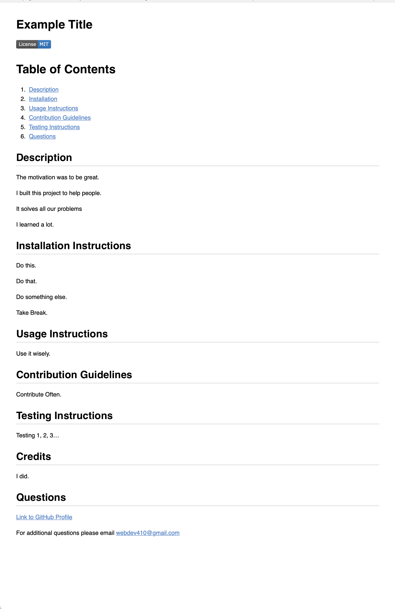

#Readme Generator

## Description
This application will generate a README.md file and automatically add it to the file directory. It will prompt the user with the following questions:

1. Project Title
2. What was your motivation?
3. Why did you build this project?
4. What problems does it solve?
5. What did you learn?
6. Installation instructions (5 prompts for 5 steps)
7. Usage Information
8. Contribution Guidelines
9. Testing Instructions
10. License Type
11. Who worked on this app?
12. GitHub Username
13. Developer Contact Email

## Links
[Repo](https://github.com/webdev410/readme-generator)

[Deployed](https://webdev410.github.io/readme-generator/)

## Screenshot & Demo Video

### [Watch the Demo Video](https://www.youtube.com/watch?v=5RItt6LS-xo)

## Questions
[Link to GitHub Profile](https://www.github.com/webdev410)

For additional questions please email webdev410@gmail.com

